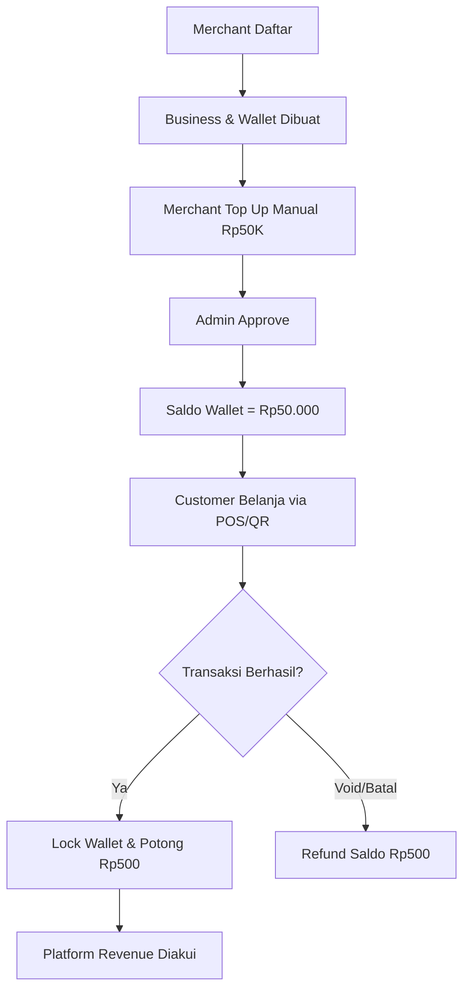
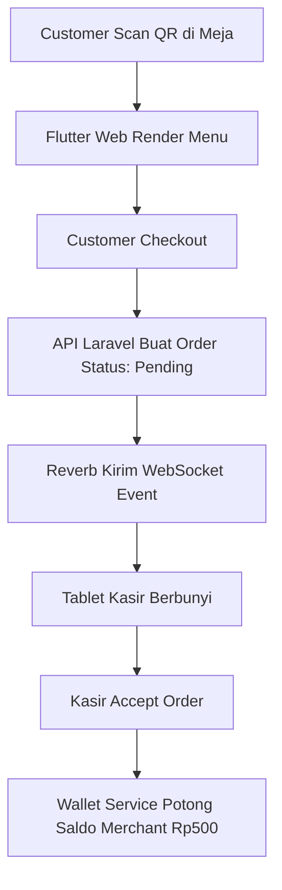

# ANTI RIBET: THE ULTIMATE BUSINESS OPERATING PLATFORM
**Master Blueprint, Technical Architecture, & Company Profile**

---

## 1. Executive Summary
AntiRibet bukan sekadar aplikasi kasir, QR menu, atau website builder. AntiRibet adalah **Business Operating Platform** (Sistem Operasi Bisnis) *all-in-one* yang dirancang khusus untuk membebaskan UMKM, F&B, retail, dan bisnis berbasis layanan dari kerumitan operasional. 

Dengan menggabungkan Mini Website, Universal Catalog, Kasir (POS), QR Order, Booking, Antrean, Invoice, Customer Database, dan Laporan Penjualan dalam satu ekosistem terpadu, AntiRibet menghapus kebutuhan akan banyak aplikasi terpisah. Didukung dengan model bisnis revolusioner **Transaction-Based Platform Fee** (Rp500 per transaksi berhasil) dan tanpa biaya langganan bulanan, AntiRibet memposisikan dirinya sebagai mitra pertumbuhan sejati bagi merchant. Saat merchant tumbuh dan bertransaksi, barulah platform mendapatkan keuntungan.

## 2. Company Profile AntiRibet
**Nama Brand:** AntiRibet  
**Makna Nama:** Menggambarkan esensi platform yang memangkas kerumitan (ribet) dalam mengelola bisnis operasional, menjadikannya mudah, praktis, rapi, dan terotomatisasi. Sangat dekat dengan keluh-kesah keseharian pebisnis UMKM.

**Vision Statement:**  
Menjadi platform operasional digital terdepan di Indonesia yang mentransformasi cara UMKM dan bisnis layanan beroperasi—menggabungkan website, transaksi, booking, dan pengelolaan pelanggan ke dalam satu ekosistem yang intuitif, transparan, dan terjangkau.

**Mission Statement:**  
1. Menyediakan mini website profesional dan kasir digital (POS) instan untuk setiap bisnis.
2. Memfasilitasi penerimaan transaksi multi-channel (QR Order, Kasir, Booking, Antrean, Invoice) tanpa friksi.
3. Memberikan visibilitas laporan keuangan dan data pelanggan secara *real-time*.
4. Mengeliminasi hambatan adopsi teknologi dengan model pembayaran "Bayar Saat Sukses" (Transaction-based).

**Core Values:**  
- **Simplicity:** Desain dan alur kerja yang mudah dipahami siapa saja.
- **Transparency:** Tidak ada biaya tersembunyi; potongan jelas Rp 500 per transaksi berhasil.
- **Affordability:** Tanpa biaya langganan bulanan yang membebani di awal.
- **Flexibility:** Mampu beradaptasi dari kedai kopi kecil hingga klinik kecantikan.
- **Merchant Empowerment:** Memberikan kendali penuh atas data dan operasional kepada pemilik bisnis.

## 3. Brand Identity
**Tagline Utama:** *Kelola Bisnis Tanpa Ribet.*  
**Tagline Alternatif:** 
- *Satu platform untuk semua kebutuhan bisnis.*
- *Dari order sampai laporan, semua jadi mudah.*

**Brand Personality:**  
Ramah, modern, efisien, terpercaya, dan sangat *UMKM-friendly*. Kami tidak menggunakan jargon teknis yang mengintimidasi; kami menggunakan bahasa yang suportif dan solutif.

**Tone of Voice:**  
Jelas, lugas, bersahabat, profesional namun santai. Fokus pada penyelesaian masalah (*problem-solving*).

**UI/UX Design Direction:**  
- **Primary Color:** Tosca/Green (Melambangkan pertumbuhan dan keuangan sehat).
- **Secondary Color:** Blue (Melambangkan kepercayaan dan teknologi).
- **Typography:** Plus Jakarta Sans / Inter (Modern, bersih, sangat terbaca).
- Pendekatan desain *Mobile-First* untuk customer, *Tablet-Friendly* untuk POS kasir, dan *Desktop-Optimized* untuk Dashboard Owner/Admin.

## 4. Problem Statement
Bisnis kecil dan menengah (SME) saat ini menghadapi fragmentasi teknologi yang parah:
1. **Tidak Punya Kehadiran Digital Terpusat:** Hanya mengandalkan Instagram/WhatsApp. Tidak ada website resmi untuk melihat katalog atau layanan, sehingga *owner* kelelahan menjawab pertanyaan berulang.
2. **Operasional Kasir Tradisional:** Masih menggunakan kertas, WhatsApp, atau kalkulator. Kesalahan rekap, *human error*, dan kebocoran dana sering terjadi.
3. **Software Fatigue (Kelelahan Aplikasi):** Untuk *go-digital*, bisnis dipaksa berlangganan Website Builder (Shopify/Wix), Aplikasi Kasir (Moka/Majoo), Sistem Booking, dan Invoice generator secara terpisah. Biaya integrasi dan langganan bulanan (*subscription*) sangat membebani *cash flow*.
4. **Antrean & Booking Berantakan:** Bisnis layanan (barbershop, klinik, rental) kesulitan mengatur jadwal; pelanggan sering bertanya status antrean secara manual.
5. **Kehilangan Data Pelanggan:** Tidak ada sistem CRM dasar untuk melacak *repeat customer* dan riwayat belanja.

## 5. Solution Overview
AntiRibet memecahkan masalah tersebut dengan menyatukan seluruh siklus hidup transaksi bisnis ke dalam satu **Universal Core Engine**:
`Business → Catalog → Transaction → Payment → Wallet → Report`

**Fitur Utama yang Saling Terhubung:**
- **Mini Website:** Auto-generated landing page (`antiribet.id/nama-bisnis`) yang merangkum identitas, jam buka, dan katalog.
- **Universal Catalog:** Mendukung *Product, Service, Package, Rental Item, dan Membership*.
- **Kasir / POS Universal:** Antarmuka tablet/mobile untuk kasir memproses pesanan di tempat.
- **QR Order:** Pelanggan memindai QR di meja/lokasi untuk memesan mandiri (terlindungi oleh *Secure Token*).
- **Booking & Queue:** Manajemen antrean dan reservasi berbasis waktu dan sumber daya (dokter, kapster, ruangan).
- **Invoice:** Pembuatan tagihan dengan dukungan *Down Payment (DP)* dan pelunasan.
- **Customer CRM & Reports:** Analitik penjualan otomatis dan pencatatan riwayat pelanggan.

## 6. Target Market
AntiRibet dirancang dengan arsitektur **Universal** dan tidak terbatas pada satu industri. Segmentasi utama:
1. **Food & Beverage (F&B):** Coffee shop, restoran, bakery, warung makan (Kebutuhan: QR Meja, POS, Kitchen Display).
2. **Beauty & Wellness:** Barbershop, salon, spa (Kebutuhan: Booking staff/kapster, Antrean, POS layanan).
3. **Health & Clinic:** Klinik gigi, praktik dokter (Kebutuhan: Booking dokter, antrean pasien, rekam transaksi medis dasar).
4. **Services & Repair:** Bengkel, servis HP, laundry (Kebutuhan: Order status, invoice, pelunasan).
5. **Rental & Spaces:** Studio foto, rental kamera, lapangan futsal (Kebutuhan: Resource management, DP, booking kalender).
6. **Professional & Retail:** Freelancer, agensi, event kecil, pet shop.

## 7. Product Architecture
AntiRibet beroperasi dalam ekosistem multi-platform:
- **Public Facing (`antiribet.id`):** Company profile utama dan gerbang masuk pelanggan ke Mini Website merchant.
- **Mini Website (`antiribet.id/slug-bisnis`):** Halaman publik merchant. Bukan hosting terpisah, melainkan *dynamic routing* yang merender data berdasarkan `business_id`.
- **Merchant Dashboard (`app.antiribet.id`):** Super-app (Flutter Web/Mobile) tempat *Owner* dan *Staff* mengelola bisnis (POS, Katalog, Laporan).
- **Backend Core (`api.antiribet.id`):** Laravel API bertenaga PostgreSQL yang menangani logika sentral, validasi *Wallet*, dan *Platform Fee*.

## 8. Feature Modules
- **Module Identity:** Profil Bisnis, Jam Operasional, Cabang (Branch).
- **Module Catalog:** Kategori, Item (Product/Service), Varian, Stok dasar.
- **Module Transaction:** POS Cart, Checkout, QR Validation, Order Accept/Reject.
- **Module Scheduling:** Kalender Booking, Ticket Antrean, Resource Assignment.
- **Module Finance:** Invoice Builder, Split Payment, DP, Wallet Saldo, Top Up.
- **Module People:** Customer Database, Staff Role Management.

## 9. Business Model
AntiRibet menggunakan model **Transaction-Based Fee** yang sangat *Fair* dan pro-merchant.
- **Tanpa Biaya Langganan (No Monthly Fee):** Merchant bisa mendaftar dan setup tanpa biaya.
- **Platform Fee:** Rp 500,- (flat) **per transaksi yang berhasil (Completed/Paid)**.
- **Konsep Deposit:** Merchant harus melakukan *Top Up* Saldo Wallet (misal Rp 50.000 untuk kuota 100 transaksi).
- **Free Trial:** 50 transaksi sukses pertama diberikan secara gratis.

## 10. Money Flow
**Prinsip: Pembayaran Pelanggan 100% Langsung ke Merchant.** (MVP Phase). AntiRibet tidak menahan uang hasil penjualan merchant.
1. Pelanggan makan di Kopi Senja senilai Rp 69.000,-
2. Pelanggan membayar langsung via QRIS/Cash ke kasir Kopi Senja.
3. Kasir menekan "Selesaikan Transaksi".
4. Sistem backend mengunci *Merchant Wallet*, memotong persis **Rp 500**, dan transaksi selesai.
5. AntiRibet baru mengakui *Revenue* sebesar Rp 500 saat transaksi tersebut tervalidasi. Uang Top Up yang belum terpotong dianggap sebagai *Liabilitas / Deferred Revenue*.

## 11. Merchant Lifecycle
Perjalanan merchant dimonitoring secara ketat menggunakan **Merchant Health Score**:
`Lead → Registered → Onboarding Setup → Trial Active (50 Tx) → First Top Up → Active Merchant → Growth / At-Risk`
- Skor diukur dari: *Setup completion*, frekuensi *login*, laju *burn rate* saldo, dan frekuensi transaksi.
- Merchant berisiko *churn* (saldo menipis namun tidak *Top Up*) akan mendapat eskalasi bantuan (WhatsApp CS/Promosi).

## 12. User Roles & Permissions
Pendekatan *Role-Based Access Control* (RBAC):
- **Super Admin (AntiRibet):** Mengawasi seluruh merchant, menyetujui Top Up, menangani *Dispute*.
- **Business Owner:** Akses penuh ke *Dashboard*, Laporan keuangan, *Wallet Top Up*, dan hapus transaksi.
- **Manager:** Dapat mengubah *Catalog*, mengatur *Staff*, membatalkan transaksi.
- **Cashier / Frontdesk:** Akses *POS*, menerima pesanan QR, *Checkout*. Tidak bisa melihat saldo *Wallet* atau laporan laba.
- **Viewer / Staff Biasa:** Hanya melihat pesanan masuk atau jadwal antrean.

## 13. Customer Flow
*Contoh Alur Pelanggan (QR Order di Meja):*
1. Pelanggan duduk di Meja 05.
2. Memindai QR Code unik (`/kopi-senja/table/5?token=ABC123`). *Token mencegah pemesanan dari luar lokasi*.
3. Pelanggan melihat menu Kopi Susu, menambah ke keranjang, dan menekan *Order*.
4. Pesanan masuk ke Dashboard Kasir (Status: *Pending*).
5. Kasir menerima pesanan (*Accept*). Saldo merchant dipotong Rp 500. Kopi dibuatkan.

## 14. Transaction Flow (Universal)
Semua sumber transaksi (POS, QR, Booking, Antrean, Invoice) bermuara pada satu entitas `transactions`.
- **Status Transaksi:** `draft` -> `pending` -> `paid/accepted` -> `completed`.
- Bisa juga: `voided`, `refunded`, `cancelled`, `expired`.
- **Aturan Pemotongan Fee:** Hanya dikenakan 1 kali saat transaksi mencapai status `paid`, `accepted` (untuk F&B), atau `completed`.

## 15. Wallet & Fee Logic (The Core Engine)
**Pessimistic Locking Mechanism:**
Untuk mencegah *race condition* (2 transaksi masuk bersamaan saat saldo tinggal Rp 500), Backend Laravel wajib menggunakan `DB::table('merchant_wallets')->lockForUpdate()`.
- Transaksi divalidasi → Lock Wallet → Cek Saldo (> Rp500) → Potong Saldo → Catat `wallet_transactions` (Debit) → Release Lock.
- **Refund Logic:** Jika pesanan ternyata *Void/Cancel* setelah diterima, sistem akan membuat `wallet_transactions` (Credit) sebesar Rp 500 dengan referensi ID Transaksi yang batal.

## 16. Dashboard Merchant
Memiliki dua mode fleksibel:
- **Mode Sederhana (Default):** Tampilan bersih berisi metrik utama (Total Jual, Omzet, Sisa Saldo), akses instan ke Kasir (POS), Katalog, Laporan, dan Top Up Wallet.
- **Mode Lengkap:** Mengaktifkan panel navigasi untuk modul ekstra seperti Booking, Queue, Invoice, Resource Management, dan Customer CRM.

## 17. Super Admin Dashboard
Pusat kontrol internal AntiRibet. Menampilkan:
- Persetujuan *Top Up Manual* (Mencocokkan bukti transfer bank dengan *request pending*).
- *Global Metrics:* Total transaksi sukses se-Indonesia, total uang Top Up mengendap, total pendapatan AntiRibet (Revenue bersih).
- *Dispute Center:* Menengahi komplain merchant terkait *platform fee*.
- Pemantauan *Merchant Health Score*.

## 18. Technical Architecture
Arsitektur dirancang dengan prinsip **Modular Monolith** untuk MVP yang solid dan mudah di-*scale*.
1. **Frontend (Flutter):** Menangani *State* (Riverpod), *Routing* (GoRouter), UI/UX multi-platform, dan *HTTP Requests* (Dio). Bertugas HANYA sebagai *View* layer.
2. **Backend (Laravel 11):** Menangani *Business Logic*, *Data Validation*, *Auth* (Sanctum), dan perhitungan uang. Sebagai *Single Source of Truth*.
3. **Database (PostgreSQL):** Multi-tenant menggunakan `business_id`. Menyimpan skema relasional yang kompleks.
4. **Cache/Realtime (Redis + Reverb):** Memancarkan event WebSocket agar Dashboard Kasir otomatis berbunyi ketika ada pesanan QR masuk.

## 19. Flutter App Architecture
Struktur *Feature-First* (Clean Architecture-lite):
```
lib/
├── core/         # Network (Dio), Storage (SecureStorage), Theme, Constants
├── features/     
│   ├── auth/         # Login, Register
│   ├── dashboard/    # Analytics, Navigation
│   ├── pos/          # BLoC/Provider untuk Cart, Product Grid
│   ├── wallet/       # Saldo, Top Up form
│   └── catalog/      # CRUD Item
└── main.dart
```

## 20. Laravel API Architecture
```
app/
├── Http/Controllers/Api/
│   ├── Merchant/     # (DashboardController, PosController, WalletController)
│   ├── Public/       # (MiniWebController, QrOrderController)
│   └── Admin/        # (AdminTopupController)
├── Services/         # Heavy Logic (TransactionService, WalletService)
├── Models/           # Eloquent
└── Events/           # OrderCreated (di-broadcast via Reverb)
```

## 21. Database Architecture & Design (PostgreSQL)
**Pendekatan Multi-Tenant Shared Database:** Semua tabel utama difilter menggunakan `business_id`.

**Core Tables & Relasi:**
1. `businesses` (id, slug, name, logo)
2. `users` (id, business_id, role, email)
3. `catalog_items` (id, business_id, type, name, price, is_available)
4. `transactions` (id, business_id, type [pos/qr/booking], status, total_amount)
5. `transaction_items` (id, transaction_id, catalog_item_id, price, qty)
6. `merchant_wallets` (id, business_id, balance)
7. `wallet_transactions` (id, merchant_wallet_id, type [credit/debit], amount, ref_id)
8. `platform_fees` (id, transaction_id, fee_amount, status)
9. `topups` (id, business_id, amount, proof, status)

**Database Constraints & Security:**
- Indexing ketat pada `(business_id, created_at)`.
- Foreign Keys constraint wajib `ON DELETE RESTRICT` pada tabel finansial.
- Kolom uang menggunakan `DECIMAL(15,2)` atau `BIGINT` (Rupiah utuh).

## 22. API Structure
Menggunakan RESTful murni dengan JSON standard response:
- `POST /api/auth/login`
- `GET /api/merchant/dashboard`
- `GET /api/merchant/catalog`
- `POST /api/merchant/pos/transactions` (Memicu Wallet Service potong Rp500)
- `POST /api/merchant/wallet/topup` (Upload bukti)
- `POST /api/public/businesses/{slug}/orders` (QR Order Submit)
- `POST /api/admin/topups/{id}/approve` (Super Admin Action)

## 23. Security & Governance
- **Isolasi Bisnis:** *Global Scope* di Eloquent `where('business_id', auth()->user()->business_id)`.
- **Idempotency:** Token unik di frontend saat checkout mencegah pembayaran ganda (*Double Click*).
- **Tokenized QR:** Mencegah spam order dari luar resto (token QR meja *expire* atau dire-generate kasir).
- **Audit Log:** Mencatat jejak *user_id* yang membatalkan transaksi atau melakukan *refund*.
- **Data Governance:** Pencadangan (*Backup*) harian ke S3. Kebijakan retensi data 5 tahun untuk transaksi finansial.

## 24. Error Handling
Sistem dirancang *fault-tolerant*:
- **Saldo Tidak Cukup:** Backend mengembalikan `402 Payment Required` dengan pesan "Saldo Wallet habis, silakan Top Up". Frontend *disable* tombol Checkout.
- **Internet Putus:** Flutter menahan `state` keranjang; memunculkan *Snackbar retry*.
- **Stok Habis / Menu Dihapus:** API mengembalikan `409 Conflict`, memandu kasir memperbarui keranjang.

## 25. Reporting & KPI
- **Daily Business Summary:** *Job Scheduler* Laravel berjalan tiap jam 00:01 merangkum omzet harian per `business_id` ke dalam agregasi tabel agar *query dashboard* super cepat.
- **KPI Startup (AntiRibet):** *Active Merchants, Total Platform Fees (Revenue), ARPM (Average Revenue Per Merchant), Churn Rate.*

## 26. Flowcharts (Mermaid System Logic)

### A. Merchant Onboarding & Full Money Flow


### B. QR Order Flow System


## 27. Roadmap Teknis & Bisnis
- **Phase 1 (MVP - Bulan 1-2):** Core POS, Katalog, Registrasi, Wallet, Manual Top Up, Dashboard, Fee Rp500, Super Admin.
- **Phase 2 (Customer Facing - Bulan 3-4):** Mini Website (`antiribet.id/slug`), QR Order, Real-time WebSocket notification.
- **Phase 3 (Booking & Services - Bulan 5-6):** Modul Booking Kalender, Antrean, Invoice DP, Customer Database CRM.
- **Phase 4 (Automation & Scale - Bulan 7+):** Integrasi Payment Gateway (Otomatisasi Top Up), WhatsApp Notifications, Mobile Apps rilis ke App Store/Play Store, *Merchant Health Scoring* AI.

## 28. MVP Scope Professional Limitation
Agar tidak terjebak *over-engineering* dan gagal rilis, **MVP HANYA mencakup**:
1. Company Profile Landing Page.
2. Login/Register Merchant.
3. Universal Catalog (Produk/Layanan).
4. POS Kasir.
5. Merchant Wallet & Manual Top Up (Approve by Admin).
6. Logika Potong Saldo Rp 500 per transaksi kasir.
7. Laporan Pendapatan Dasar.
*(Modul Booking, Queue, QR, dan Mobile App Native ditunda hingga MVP Core Stabil)*.

## 29. Professional Suggestions / Missing Additions (Saran Arsitek)
Dari kacamata *CTO & Business Architect*, ide Anda brilian, namun perlu ditambahkan perlindungan ekstra:
1. **Legal & Compliance:** Syarat & Ketentuan (TOS) harus tegas menyatakan saldo Wallet tidak bisa diuangkan kembali (*Non-refundable*) jika *merchant* tutup bisnis, untuk menghindari regulasi OJK terkait *e-money*.
2. **Anti-Spam QR:** Customer nakal bisa men-scan QR meja, menyebarkannya di grup WhatsApp, lalu memesan ratusan menu fiktif. Solusi: Gunakan *Rolling Token* QR yang berubah setiap kali meja dikosongkan.
3. **Pemisahan Traffic:** Pisahkan *Domain/Server* untuk `api.antiribet.id` (internal kasir) dan `public.antiribet.id` (trafik pelanggan scan QR) agar jika trafik scan publik meledak, sistem kasir merchant tidak ikut *down*.

## 30. Final Conclusion
**AntiRibet** memiliki potensi besar menjadi *Game Changer* di ekosistem B2B SaaS Indonesia. Dengan menggabungkan teknologi modern (*Flutter & Laravel*) dan model bisnis "Transaksi Sukses" (*Micro-Transaction Fee* Rp 500), platform ini menurunkan *barrier to entry* bagi UMKM menuju digitalisasi tanpa biaya bulanan yang mencekik. Arsitektur *Modular Monolith Multi-Tenant* memastikan pengembangan tetap cepat di tahap awal, namun sangat siap bertumbuh (*scalable*) ketika fitur Booking, Antrean, dan Invoice ditambahkan di masa depan.

Ini bukan sekadar aplikasi kasir; ini adalah **Sistem Operasi Bisnis Masa Depan**.
