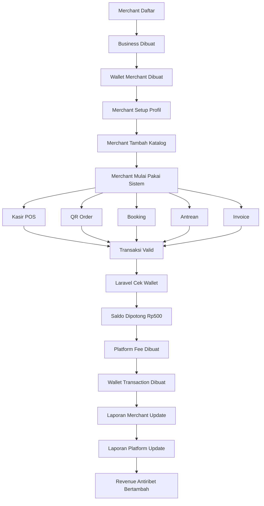
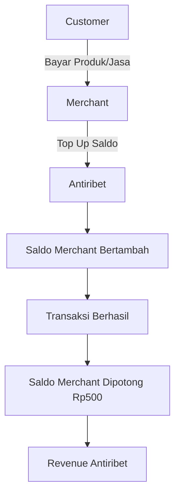
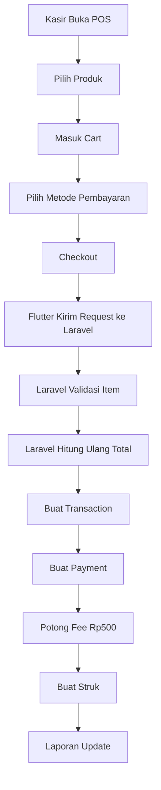
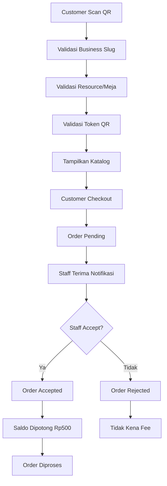
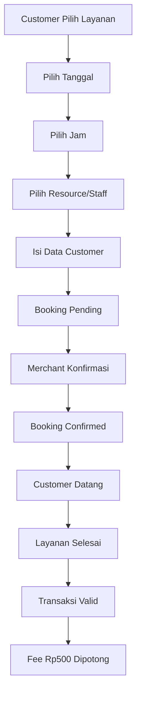
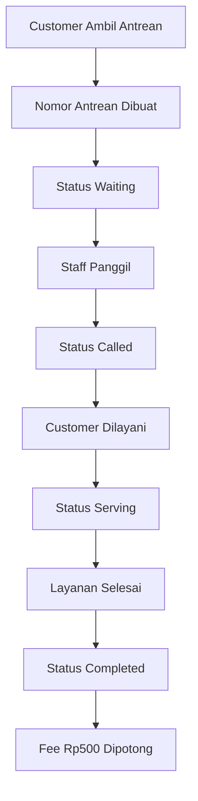
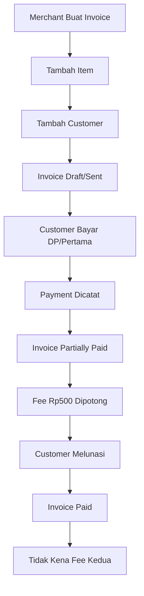
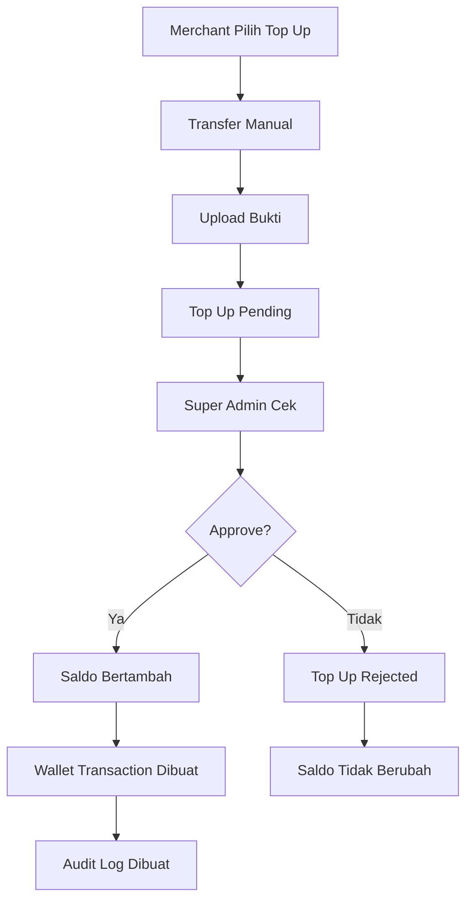
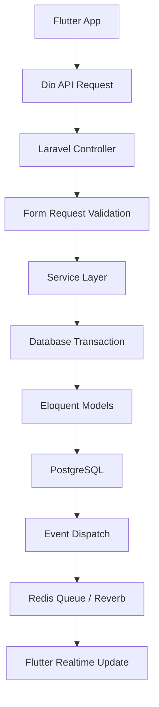

# 1. Gambaran Besar Ide Antiribet

Awalnya kamu ingin membuat website untuk coffee shop atau restoran agar customer tidak perlu antre. Customer cukup scan barcode atau QR code di meja, lalu bisa langsung pesan dari HP.

Ide awalnya kira-kira seperti ini:

```text
Customer datang ke coffee shop / restoran
↓
Customer duduk di meja
↓
Customer scan QR di meja
↓
Customer melihat menu
↓
Customer memilih makanan/minuman
↓
Order masuk ke staff
↓
Staff memproses pesanan
↓
Customer tidak perlu antre ke kasir
```

Itu adalah ide awal yang bagus.

Tapi setelah dibahas lebih dalam, ide kamu berkembang jauh lebih besar. Kamu tidak ingin hanya membuat website untuk satu restoran atau satu coffee shop. Kamu ingin membuat **satu platform utama** yang bisa digunakan oleh banyak bisnis.

Jadi konsepnya berubah menjadi:

```text
Satu website/platform utama
↓
Banyak bisnis bisa daftar
↓
Setiap bisnis punya mini website sendiri
↓
Setiap bisnis bisa punya katalog, kasir, QR order, booking, antrean, invoice, laporan
↓
Merchant cukup top up saldo
↓
Saldo dipotong Rp500 setiap transaksi berhasil
```

Dari sini lahirlah konsep final:

```text
Antiribet adalah platform all-in-one untuk semua jenis bisnis agar bisa punya mini website, kasir/POS, QR order, booking, antrean, invoice, customer database, laporan, dan sistem saldo transaksi dalam satu platform.
```

Kalimat sederhana untuk menjelaskan Antiribet:

```text
Antiribet membantu bisnis punya website, kasir, order, booking, antrean, invoice, dan laporan tanpa ribet.
```

Atau versi positioning yang lebih kuat:

```text
Satu platform untuk website bisnis, kasir, QR order, booking, antrean, invoice, customer database, dan laporan — tanpa biaya bulanan, cukup Rp500 per transaksi berhasil.
```

---

# 2. Masalah yang Diselesaikan Antiribet

Banyak bisnis kecil dan menengah punya masalah yang mirip.

Contohnya:

```text
- Tidak punya website sendiri
- Masih mencatat pesanan manual
- Belum punya aplikasi kasir
- Customer harus antre untuk pesan
- Booking masih lewat WhatsApp manual
- Antrean masih pakai catatan/kertas
- Invoice masih dibuat manual
- Laporan penjualan tidak rapi
- Data customer tidak tersimpan
- Staff bingung memakai banyak aplikasi berbeda
- Owner sulit memantau transaksi harian
- Aplikasi kasir berlangganan terasa mahal
```

Biasanya bisnis harus memakai banyak tools terpisah:

```text
Website builder
+ aplikasi kasir
+ QR menu
+ sistem booking
+ sistem antrean
+ spreadsheet laporan
+ invoice manual
+ WhatsApp manual
```

Antiribet menyatukan semuanya.

```text
Mini website
+ katalog
+ kasir
+ QR order
+ booking
+ antrean
+ invoice
+ customer database
+ laporan
+ saldo deposit
```

Jadi value utama Antiribet adalah:

```text
Bisnis tidak perlu berlangganan banyak aplikasi. Semua kebutuhan operasional dasar bisnis masuk dalam satu platform.
```

---

# 3. Target Pengguna Antiribet

Antiribet tidak hanya untuk coffee shop atau restoran. Kamu ingin semua bidang bisnis bisa menggunakan platform ini.

Target bisnisnya bisa meliputi:

```text
- Coffee shop
- Restoran
- Warung makan
- Barbershop
- Salon
- Klinik
- Laundry
- Bengkel
- Service HP
- Toko retail
- Rental
- Kursus
- Gym
- Studio
- Agency
- Freelancer
- Konsultan
- Event organizer
- Percetakan
- Bisnis jasa profesional
```

Agar semua bidang bisnis bisa memakai Antiribet, kamu tidak boleh membuat sistem yang terlalu khusus hanya untuk restoran.

Jangan berpikir seperti ini:

```text
Sistem restoran sendiri
Sistem barbershop sendiri
Sistem laundry sendiri
Sistem klinik sendiri
Sistem rental sendiri
```

Itu akan terlalu berat.

Yang benar adalah membuat **core system universal**.

Semua bisnis sebenarnya punya pola yang mirip:

```text
Bisnis punya sesuatu yang dijual
Bisnis punya customer
Bisnis punya transaksi
Bisnis punya pembayaran
Bisnis punya staff
Bisnis punya laporan
Bisnis punya status pekerjaan
```

Maka Antiribet harus punya struktur universal:

```text
Business
Branch
Staff
Customer
Catalog
Resource
Transaction
Payment
Wallet
Booking
Queue
Invoice
Report
Audit Log
```

Contoh penerapannya:

```text
Coffee shop:
Catalog = menu
Resource = meja
Transaction = order makanan/minuman

Barbershop:
Catalog = layanan
Resource = barber/kursi
Transaction = jasa haircut

Laundry:
Catalog = paket laundry
Resource = kurir/mesin/cabang
Transaction = order laundry

Rental:
Catalog = item rental
Resource = unit barang
Transaction = booking sewa

Klinik:
Catalog = layanan pemeriksaan
Resource = dokter/ruangan
Transaction = kunjungan pasien
```

Jadi walaupun nama industrinya berbeda, mesin sistemnya tetap sama.

---

# 4. Konsep Utama Platform Antiribet

Antiribet terdiri dari beberapa bagian besar:

```text
1. Website utama Antiribet
2. Mini website merchant
3. Dashboard merchant
4. Dashboard staff
5. Super admin dashboard
6. Customer pages
7. Backend API
8. Database
9. Wallet/saldo system
10. Realtime system
```

Struktur domain bisa seperti ini:

```text
antiribet.id
```

Sebagai website utama.

```text
antiribet.id/kopi-senja
antiribet.id/barber-jaya
antiribet.id/laundry-cepat
```

Sebagai mini website merchant.

```text
app.antiribet.id
```

Sebagai aplikasi dashboard Flutter Web.

```text
api.antiribet.id
```

Sebagai Laravel API backend.

---

# 5. Mini Website Merchant

Setiap bisnis yang daftar di Antiribet akan punya mini website sendiri.

Contoh:

```text
antiribet.id/kopi-senja
antiribet.id/barber-jaya
antiribet.id/laundry-cepat
antiribet.id/klinik-sehat
```

Mini website berisi:

```text
- Nama bisnis
- Logo
- Banner
- Deskripsi bisnis
- Alamat
- Jam buka
- Nomor WhatsApp
- Instagram
- Galeri
- Katalog produk/layanan
- Tombol order
- Tombol booking
- Tombol antrean
- Tombol invoice/status order
```

Mini website ini bukan hosting terpisah. Semua tetap berjalan di platform utama Antiribet.

Logikanya:

```text
Customer membuka antiribet.id/kopi-senja
↓
Sistem membaca slug "kopi-senja"
↓
Laravel mencari business dengan slug tersebut
↓
Laravel mengambil data bisnis dari database
↓
Flutter Web / halaman publik menampilkan mini website
```

Jadi tidak perlu satu hosting untuk satu merchant. Semua merchant berada dalam satu sistem utama.

---

# 6. Fitur Utama Antiribet

Fitur utama Antiribet adalah:

```text
1. Mini Website
2. Universal Catalog
3. Kasir / POS
4. QR Order
5. Booking / Reservation
6. Queue / Antrean
7. Invoice
8. Customer Database
9. Resource Management
10. Staff Management
11. Wallet / Saldo Deposit
12. Reports & Analytics
13. Super Admin Control Center
```

Sekarang kita jelaskan satu per satu.

---

# 7. Universal Catalog

Jangan memakai istilah “menu” saja, karena tidak semua bisnis punya menu.

Gunakan istilah:

```text
Catalog
```

Catalog bisa berisi:

```text
- Produk
- Menu makanan
- Layanan
- Paket
- Tiket
- Membership
- Item rental
```

Contoh:

```text
Coffee shop:
Kopi Susu = product

Barbershop:
Haircut Basic = service

Rental:
Kamera Sony = rental_item

Gym:
Membership Bulanan = membership

Kursus:
Kelas Public Speaking = package/service
```

Struktur catalog:

```text
catalog_items
- id
- business_id
- category_id
- type
- name
- description
- price
- image
- duration
- stock
- is_available
- status
```

Jenis `type`:

```text
product
service
package
ticket
membership
rental_item
```

---

# 8. Sistem Kasir / POS

Karena kamu ingin Antiribet menjadi all-in-one, maka sistem kasir/POS adalah fitur inti.

Tujuannya:

```text
Merchant tidak perlu berlangganan aplikasi kasir lain.
```

Fitur kasir:

```text
- Pilih produk/layanan
- Tambah ke cart
- Ubah quantity
- Catatan item
- Diskon
- Pajak opsional
- Service charge opsional
- Metode pembayaran
- Selesaikan transaksi
- Cetak struk
- Void transaksi
- Refund transaksi
- Laporan kasir
```

Alur kasir:

```text
Kasir membuka halaman POS
↓
Kasir memilih produk/layanan
↓
Produk masuk cart
↓
Kasir memilih metode pembayaran
↓
Kasir klik selesaikan transaksi
↓
Backend menghitung ulang total
↓
Backend membuat transaksi
↓
Backend membuat payment
↓
Backend memotong saldo merchant Rp500
↓
Struk muncul
↓
Laporan bertambah
```

Penting:

```text
Flutter boleh menghitung total untuk tampilan.
Laravel wajib menghitung ulang total untuk kebenaran.
```

Kenapa?

Karena frontend bisa dimanipulasi. Backend harus tetap menjadi sumber kebenaran.

---

# 9. QR Order

QR order adalah fitur awal yang kamu pikirkan.

Customer scan QR di meja atau lokasi bisnis, lalu pesan tanpa antre.

Jenis QR:

```text
- QR menu umum
- QR meja
- QR takeaway
- QR booking
- QR antrean
- QR cek status
```

Contoh URL QR:

```text
antiribet.id/kopi-senja/table/5?token=A8F2K9
```

Kenapa harus ada token?

Karena kalau URL hanya seperti ini:

```text
antiribet.id/kopi-senja/table/5
```

Orang bisa menebak dan membuat order palsu.

Dengan token:

```text
?token=A8F2K9
```

QR menjadi lebih aman.

Alur QR order:

```text
Customer scan QR
↓
Sistem validasi business slug
↓
Sistem validasi meja/resource
↓
Sistem validasi token QR
↓
Customer melihat katalog
↓
Customer checkout
↓
Order masuk status pending
↓
Staff menerima notifikasi
↓
Staff accept order
↓
Saldo merchant dipotong Rp500
↓
Order diproses
```

---

# 10. Booking / Reservation

Booking digunakan untuk bisnis yang membutuhkan jadwal.

Contoh:

```text
- Barbershop
- Salon
- Klinik
- Studio
- Rental
- Kursus
- Konsultan
```

Alur booking:

```text
Customer membuka mini website
↓
Pilih layanan
↓
Pilih tanggal
↓
Pilih jam
↓
Pilih resource/staff jika ada
↓
Isi nama dan nomor WhatsApp
↓
Booking dibuat status pending
↓
Merchant konfirmasi
↓
Booking menjadi confirmed
↓
Customer datang
↓
Layanan selesai
↓
Transaksi valid
↓
Fee Rp500 dikenakan
```

Aturan fee booking yang paling adil:

```text
Fee dikenakan saat booking completed atau saat pembayaran tercatat.
```

Karena booking pending belum tentu menjadi transaksi. Customer bisa saja tidak datang.

---

# 11. Antrean / Queue

Antrean cocok untuk:

```text
- Klinik
- Barbershop
- Bengkel
- Service HP
- Customer service
```

Alur antrean:

```text
Customer buka halaman antrean
↓
Pilih layanan
↓
Isi nama
↓
Ambil nomor antrean
↓
Status waiting
↓
Staff panggil nomor
↓
Status called
↓
Customer dilayani
↓
Status serving
↓
Layanan selesai
↓
Status completed
↓
Fee Rp500 dikenakan
```

Fee jangan dikenakan saat customer baru ambil nomor, karena customer bisa saja tidak datang.

Fee lebih logis dikenakan saat layanan selesai.

---

# 12. Invoice

Invoice digunakan untuk bisnis yang tidak selalu transaksi langsung di kasir.

Contoh:

```text
- Rental
- Agency
- Bengkel
- Laundry
- Konsultan
- Event organizer
- Percetakan
- Kursus
```

Fitur invoice:

```text
- Buat invoice
- Tambah item
- Tambah customer
- Tambah diskon
- Tambah pajak
- Catat DP
- Catat pelunasan
- Status partially paid
- Status paid
- Download PDF
- Share invoice
```

Alur invoice:

```text
Merchant membuat invoice
↓
Tambah item/layanan
↓
Pilih customer
↓
Simpan invoice
↓
Status draft/sent
↓
Customer membayar DP atau pembayaran pertama
↓
Merchant mencatat payment
↓
Invoice menjadi partially_paid
↓
Fee Rp500 dikenakan
↓
Saat lunas, invoice menjadi paid
↓
Tidak dikenakan fee kedua
```

Aturan paling logis:

```text
Satu invoice hanya dikenakan satu fee, yaitu saat pembayaran pertama tercatat.
```

---

# 13. Customer Database

Setiap bisnis punya database customer.

Data customer:

```text
- Nama
- Nomor WhatsApp
- Email
- Alamat
- Catatan
- Riwayat transaksi
- Total belanja
- Terakhir transaksi
```

Manfaat:

```text
- Merchant bisa tahu customer loyal
- Merchant bisa melihat riwayat transaksi
- Merchant bisa menyimpan alamat
- Merchant bisa follow-up manual via WhatsApp
```

---

# 14. Resource Management

Resource adalah konsep universal untuk “aset” atau “kapasitas” yang dipakai bisnis.

Resource bisa berupa:

```text
- Meja
- Barber
- Dokter
- Ruangan
- Lapangan
- Kendaraan
- Kamera
- Alat rental
- Mesin
- Staff
```

Contoh:

```text
Coffee shop:
Resource = Meja 1, Meja 2, Meja 3

Barbershop:
Resource = Barber A, Barber B, Kursi 1

Klinik:
Resource = Dokter A, Ruang Periksa 1

Rental:
Resource = Kamera Sony A6400, Mobil Avanza
```

Resource dipakai untuk:

```text
- QR order
- Booking
- Antrean
- Rental
- Jadwal
```

---

# 15. Staff Management

Role staff harus dibedakan.

Role dasar:

```text
- Owner
- Manager
- Cashier
- Operator
- Staff
- Viewer
- Super Admin
```

Permission contoh:

```text
catalog.view
catalog.create
catalog.update
catalog.delete

pos.access
transaction.create
transaction.void
transaction.refund

wallet.view
wallet.topup
wallet.adjust

report.view
staff.manage
business.settings
admin.access
```

Prinsip:

```text
Frontend menyembunyikan menu.
Backend tetap mengamankan akses.
```

Jadi walaupun tombol “Wallet” disembunyikan dari kasir, backend tetap harus menolak jika kasir mencoba akses API wallet.

---

# 16. Model Bisnis Antiribet

Model bisnis final:

```text
Merchant top up saldo
↓
Merchant menerima transaksi
↓
Setiap transaksi berhasil dipotong Rp500
↓
Rp500 menjadi pendapatan Antiribet
```

Tidak ada:

```text
- Biaya bulanan wajib
- Premium domain
- Premium subdomain
- Biaya per produk
- Biaya per item
```

Yang dikenakan:

```text
Rp500 per transaksi berhasil
```

Definisi transaksi berhasil:

```text
1 transaksi berhasil = 1 struk / order / booking / invoice / layanan yang valid, diterima, selesai, atau tercatat pembayaran.
```

Bukan:

```text
- per produk
- per item
- per meja
- per customer scan
- per customer lihat website
```

---

# 17. Alur Uang Antiribet

Ini bagian paling penting.

Untuk MVP, model uang paling aman:

```text
Customer bayar langsung ke merchant.
Merchant top up saldo ke Antiribet.
Antiribet memotong saldo merchant Rp500 setiap transaksi berhasil.
```

Artinya:

```text
Uang customer = masuk ke merchant
Saldo top up = deposit merchant di Antiribet
Fee Rp500 = revenue Antiribet
```

Contoh:

```text
Merchant top up Rp100.000
↓
Saldo merchant = Rp100.000
↓
Setara 200 transaksi
↓
Customer belanja Rp69.000
↓
Customer bayar langsung ke merchant
↓
Transaksi berhasil
↓
Saldo merchant dipotong Rp500
↓
Saldo menjadi Rp99.500
↓
Revenue Antiribet = Rp500
```

Penting:

```text
Top up masuk bukan revenue final.
Revenue final adalah fee yang benar-benar terpotong dari transaksi.
```

Jadi kalau merchant top up Rp100.000, itu belum semuanya dianggap pendapatan. Pendapatan dihitung saat saldo terpakai untuk fee.

---

# 18. Paket Top Up

Paket top up yang mudah dipahami:

```text
Rp50.000 = 100 transaksi
Rp100.000 = 200 transaksi
Rp250.000 = 500 transaksi
Rp500.000 = 1.000 transaksi
Rp1.000.000 = 2.000 transaksi
```

Ini bukan paket premium.

Ini adalah:

```text
Saldo transaksi
```

---

# 19. Trial Merchant

Agar merchant mau mencoba:

```text
50 transaksi pertama gratis
```

Atau saat launching:

```text
100 transaksi pertama gratis untuk merchant awal
```

Alur trial:

```text
Merchant daftar
↓
Dapat trial_quota = 50
↓
Transaksi berhasil
↓
Jika trial_quota > 0, kuota berkurang
↓
Saldo tidak dipotong
↓
Setelah trial habis, saldo mulai dipotong Rp500
```

---

# 20. Aturan Fee Rp500

Aturan fee:

```text
Pending = belum kena fee
Accepted = kena fee
Paid = kena fee
Completed = fee tetap
Cancelled = refund fee jika sudah dipotong
Rejected = tidak kena fee
Expired = tidak kena fee
Voided = refund fee
```

Kenapa fee sebaiknya dipotong saat accepted atau paid?

Karena kalau menunggu completed, merchant bisa lupa klik selesai. Bahkan bisa saja ada merchant yang sengaja tidak menyelesaikan transaksi agar saldo tidak terpotong.

Jadi logika aman:

```text
Transaksi diterima/paid = fee dipotong
Transaksi dibatalkan/void = fee dikembalikan
```

---

# 21. Dashboard Merchant

Dashboard merchant berisi:

```text
- Ringkasan
- Website Bisnis
- Katalog
- Kasir/POS
- Transaksi
- QR Order
- Booking
- Antrean
- Invoice
- Customer
- Resource
- Staff
- Laporan
- Saldo & Billing
- Pengaturan
```

Agar tidak membingungkan, dashboard sebaiknya punya dua mode:

```text
Mode Sederhana
Mode Lengkap
```

Mode sederhana:

```text
- Mini website
- Katalog
- Kasir
- Transaksi
- Laporan
- Saldo
```

Mode lengkap:

```text
- QR order
- Booking
- Antrean
- Invoice
- Resource
- Form builder
- Workflow custom
```

---

# 22. Super Admin Dashboard

Super admin digunakan oleh pemilik Antiribet.

Fitur:

```text
- Melihat semua merchant
- Melihat merchant aktif
- Melihat merchant tidak aktif
- Melihat top up pending
- Approve top up
- Reject top up
- Melihat total transaksi platform
- Melihat total fee platform
- Melihat merchant saldo rendah
- Melihat merchant saldo minus
- Memberi saldo bonus
- Melihat dispute fee
- Melihat laporan platform
```

Super admin harus memiliki audit log. Setiap approve top up, reject top up, ubah saldo, atau suspend merchant harus tercatat.

---

# 23. Tech Stack Final Versi Flutter

Karena kamu ingin Antiribet bisa digunakan di:

```text
- Website
- Android
- iOS
```

Maka tech stack final yang paling logis adalah:

```text
Flutter + Laravel API + PostgreSQL + Redis
```

Detail:

```text
Frontend:
Flutter

Language:
Dart

Target Platform:
Flutter Web
Flutter Android
Flutter iOS

Backend:
Laravel API

Database:
PostgreSQL

Cache / Queue:
Redis

Realtime:
Laravel Reverb / WebSocket

Authentication:
Laravel Sanctum API Token

Storage:
Local storage untuk MVP
S3-compatible storage untuk production

Deployment:
Laravel API di VPS/cloud
Flutter Web static hosting/CDN
Android ke Play Store
iOS ke App Store
```

Kalimat teknis final:

```text
Antiribet dibangun sebagai platform multi-client dengan Flutter sebagai frontend utama untuk Web, Android, dan iOS, serta Laravel API sebagai backend utama.
```

---

# 24. Arsitektur Teknis Antiribet

Arsitektur besarnya:

```text
Flutter Web / Android / iOS
        ↓
REST API / WebSocket
        ↓
Laravel API Backend
        ↓
Service Layer
        ↓
PostgreSQL Database
        ↓
Redis Queue / Cache
        ↓
Storage / Reports / Notifications
```

Atau lebih sederhana:

```text
Flutter menampilkan UI
Laravel memproses logic bisnis
PostgreSQL menyimpan data
Redis mempercepat proses
Reverb/WebSocket membuat realtime
Storage menyimpan file
```

Prinsip utama:

```text
Flutter menampilkan.
Laravel memutuskan.
PostgreSQL menyimpan.
Redis mempercepat.
Reverb memberi realtime.
```

---

# 25. Kenapa Flutter Cocok?

Flutter cocok karena:

```text
- Satu codebase untuk web, Android, dan iOS
- Cocok untuk aplikasi kasir tablet
- Cocok untuk dashboard owner
- Cocok untuk staff app
- UI konsisten lintas platform
- Bisa masuk Play Store dan App Store
- Bisa dikembangkan ke offline mode
```

Dengan Flutter, kamu bisa membuat:

```text
- Flutter Web untuk dashboard
- Flutter Android untuk staff/kasir/owner
- Flutter iOS untuk staff/kasir/owner
- Flutter Web customer page untuk QR order/booking/antrean
```

---

# 26. Catatan Penting Flutter Web dan SEO

Flutter Web bagus untuk:

```text
- Dashboard merchant
- Kasir/POS
- Admin panel
- Customer order page
- Booking flow
- Antrean
- Invoice view
```

Tapi Flutter Web tidak selalu ideal untuk:

```text
- Landing page yang butuh SEO kuat
- Mini website merchant yang ingin muncul bagus di Google
- Blog/artikel
```

Jadi ada dua opsi:

## Opsi 1 — Semua Flutter

```text
Landing page, mini website, dashboard, order, booking semuanya Flutter.
```

Kelebihan:

```text
Satu frontend utama.
```

Kekurangan:

```text
SEO public page lebih menantang.
```

## Opsi 2 — Hybrid yang lebih profesional

```text
Landing page dan mini website public = Laravel Blade / HTML
Dashboard, POS, admin, QR order = Flutter
```

Rekomendasi saya:

```text
Gunakan Flutter untuk aplikasi interaktif.
Gunakan Laravel Blade/HTML untuk halaman publik yang butuh SEO.
```

Tapi kalau kamu ingin mulai lebih simpel, semua bisa Flutter dulu, lalu public SEO page ditingkatkan nanti.

---

# 27. Flutter Stack Detail

Flutter stack yang saya sarankan:

```text
Flutter
Dart
Riverpod
go_router
Dio
freezed
json_serializable
flutter_secure_storage
shared_preferences
web_socket_channel
qr_flutter
mobile_scanner
fl_chart
pdf
printing
intl
```

Fungsinya:

```text
Flutter = UI multi-platform
Dart = bahasa Flutter
Riverpod = state management
go_router = routing
Dio = HTTP client ke Laravel API
freezed = model immutable
json_serializable = parsing JSON
flutter_secure_storage = simpan token mobile
shared_preferences = simpan setting ringan
web_socket_channel = koneksi WebSocket
qr_flutter = generate QR
mobile_scanner = scan QR di mobile
fl_chart = grafik laporan
pdf = generate PDF
printing = print/share PDF
intl = format tanggal dan Rupiah
```

---

# 28. Struktur Flutter App

Struktur Flutter sebaiknya feature-first:

```text
lib/
├── app/
│   ├── app.dart
│   ├── router.dart
│   ├── theme.dart
│   └── bootstrap.dart
│
├── core/
│   ├── config/
│   ├── constants/
│   ├── errors/
│   ├── network/
│   ├── storage/
│   ├── utils/
│   └── widgets/
│
├── features/
│   ├── auth/
│   ├── business_site/
│   ├── dashboard/
│   ├── catalog/
│   ├── pos/
│   ├── transactions/
│   ├── wallet/
│   ├── topup/
│   ├── qr_order/
│   ├── booking/
│   ├── queue/
│   ├── invoice/
│   ├── customer/
│   ├── reports/
│   ├── staff/
│   └── admin/
│
└── main.dart
```

Setiap feature:

```text
features/pos/
├── data/
│   ├── models/
│   ├── repositories/
│   └── datasources/
├── domain/
│   ├── entities/
│   └── usecases/
├── presentation/
│   ├── screens/
│   ├── widgets/
│   └── providers/
└── pos_routes.dart
```

---

# 29. Backend Laravel API

Karena Flutter menjadi frontend utama, Laravel harus menjadi API server.

Laravel API menangani:

```text
- Auth
- Business
- Catalog
- POS/Transaction
- Wallet
- Topup
- QR Order
- Booking
- Queue
- Invoice
- Report
- Staff
- Admin
- Realtime event
- Background job
```

Struktur backend:

```text
app/
├── Http/
│   ├── Controllers/
│   │   ├── Api/
│   │   │   ├── Auth/
│   │   │   ├── Public/
│   │   │   ├── Merchant/
│   │   │   └── Admin/
│   ├── Requests/
│   └── Middleware/
│
├── Models/
├── Services/
│   ├── Business/
│   ├── Catalog/
│   ├── Transaction/
│   ├── Wallet/
│   ├── Topup/
│   ├── Booking/
│   ├── Queue/
│   ├── Invoice/
│   ├── Report/
│   └── Staff/
│
├── Events/
├── Listeners/
├── Jobs/
├── Policies/
├── Notifications/
└── Support/
```

---

# 30. Laravel Services

Logic bisnis jangan ditaruh di controller.

Gunakan service:

```text
BusinessService
BusinessSetupService
CatalogService
TransactionService
PosTransactionService
PaymentService
WalletService
PlatformFeeService
TopupService
BookingService
QueueService
InvoiceService
ReportService
AuditLogService
QrCodeService
PermissionService
```

Controller hanya:

```text
- menerima request
- memanggil service
- mengembalikan response
```

Service menjalankan logic utama.

---

# 31. API Endpoint

Endpoint auth:

```text
POST /api/auth/login
POST /api/auth/logout
GET  /api/auth/me
```

Endpoint public:

```text
GET  /api/public/businesses/{slug}
GET  /api/public/businesses/{slug}/catalog
POST /api/public/businesses/{slug}/orders
POST /api/public/businesses/{slug}/bookings
POST /api/public/businesses/{slug}/queues
```

Endpoint merchant:

```text
GET    /api/merchant/dashboard
GET    /api/merchant/catalog
POST   /api/merchant/catalog
PUT    /api/merchant/catalog/{id}
DELETE /api/merchant/catalog/{id}

POST   /api/merchant/pos/transactions
GET    /api/merchant/transactions
GET    /api/merchant/transactions/{id}
POST   /api/merchant/transactions/{id}/void

GET    /api/merchant/wallet
POST   /api/merchant/topups
GET    /api/merchant/reports
```

Endpoint admin:

```text
GET  /api/admin/businesses
GET  /api/admin/topups
POST /api/admin/topups/{id}/approve
POST /api/admin/topups/{id}/reject
GET  /api/admin/platform-fees
GET  /api/admin/reports
```

---

# 32. Format Response API

Response sukses:

```json
{
  "success": true,
  "message": "Transaksi berhasil dibuat.",
  "data": {}
}
```

Response error:

```json
{
  "success": false,
  "message": "Saldo merchant tidak cukup.",
  "errors": {}
}
```

Pagination:

```json
{
  "data": [],
  "meta": {
    "current_page": 1,
    "last_page": 10,
    "per_page": 20,
    "total": 200
  }
}
```

---

# 33. Database Utama

Gunakan PostgreSQL.

Tabel utama:

```text
users
businesses
branches
business_settings
business_staff
catalog_categories
catalog_items
resources
customers
transactions
transaction_items
payments
merchant_wallets
wallet_transactions
platform_fees
topups
bookings
queues
invoices
invoice_items
audit_logs
```

Prinsip:

```text
Hampir semua tabel harus punya business_id.
```

Agar data merchant tidak bercampur.

---

# 34. Multi-Tenant Logic

Antiribet adalah multi-tenant platform.

Artinya:

```text
Satu sistem
Satu database utama
Banyak merchant
Data dipisahkan dengan business_id
```

Contoh:

```text
Kopi Senja = business_id 1
Barber Jaya = business_id 2
Laundry Cepat = business_id 3
```

Semua query merchant harus:

```sql
WHERE business_id = current_business_id
```

Jangan biarkan frontend mengirim business_id bebas.

Yang benar:

```text
business_id diambil dari user login/current business di backend.
```

---

# 35. Authentication Flow

Alur login:

```text
User buka Flutter app
↓
Masukkan email/password
↓
Flutter kirim ke /api/auth/login
↓
Laravel validasi user
↓
Laravel membuat token
↓
Flutter menyimpan token
↓
Setiap API request memakai Bearer token
↓
Laravel validasi token
```

Data login response:

```json
{
  "user": {},
  "business": {},
  "roles": [],
  "permissions": [],
  "token": "..."
}
```

Token di mobile disimpan di:

```text
flutter_secure_storage
```

---

# 36. Wallet Technical Logic

Wallet adalah pusat monetisasi Antiribet.

Tabel:

```text
merchant_wallets
wallet_transactions
platform_fees
topups
```

Alur potong fee:

```text
Transaksi valid
↓
Cek fee belum pernah dikenakan
↓
Lock wallet merchant
↓
Potong Rp500
↓
Buat platform_fee
↓
Buat wallet_transaction
↓
Update balance
↓
Broadcast WalletBalanceChanged
```

Harus memakai database transaction:

```text
Jika transaksi gagal, saldo tidak boleh terpotong.
Jika saldo gagal dipotong, transaksi tidak boleh dianggap sukses.
```

---

# 37. Realtime Flow

Realtime digunakan untuk:

```text
- order baru
- saldo berubah
- top up approved
- antrean dipanggil
- booking dikonfirmasi
```

Alur:

```text
Laravel event dibuat
↓
Laravel Reverb broadcast
↓
Flutter WebSocket client menerima event
↓
Riverpod provider update state
↓
UI berubah realtime
```

Event:

```text
OrderCreated
OrderAccepted
WalletBalanceChanged
TopupApproved
QueueCalled
BookingConfirmed
```

---

# 38. Flowchart Utama Antiribet

Berikut flowchart besar dari seluruh sistem:



---

# 39. Flowchart Uang



Penjelasan:

```text
Customer membayar langsung ke merchant.
Merchant top up saldo ke Antiribet.
Antiribet tidak memegang uang penjualan customer.
Antiribet hanya mengambil Rp500 dari saldo merchant saat transaksi berhasil.
```

---

# 40. Flowchart POS



---

# 41. Flowchart QR Order



---

# 42. Flowchart Booking



---

# 43. Flowchart Antrean



---

# 44. Flowchart Invoice



---

# 45. Flowchart Top Up



---

# 46. Flowchart Technical Request



---

# 47. Edge Case yang Harus Ditangani

Sistem harus siap menghadapi kondisi tidak ideal.

## 47.1 Saldo tidak cukup

```text
Transaksi valid
↓
Sistem mau potong fee
↓
Saldo melewati minus limit
↓
Transaksi ditolak
↓
Merchant diminta top up
```

## 47.2 Staff double click checkout

Solusi:

```text
Flutter disable button saat loading
Backend pakai idempotency key
platform_fees.transaction_id unique
Database transaction
```

## 47.3 Internet putus saat checkout

Solusi:

```text
Flutter cek ulang status transaksi
Jangan langsung membuat transaksi baru
Gunakan idempotency key
```

## 47.4 Customer order item habis

```text
Checkout ditolak
Tampilkan item tidak tersedia
```

## 47.5 QR token tidak valid

```text
Tampilkan QR tidak valid atau sudah diganti
```

## 47.6 Staff tidak punya izin

```text
Return 403 Forbidden
```

## 47.7 Transaksi dibatalkan setelah fee dipotong

```text
Refund fee Rp500
Update platform_fee menjadi refunded
Tambah wallet_transaction +Rp500
```

---

# 48. Security Logic

Security wajib ada di beberapa level.

## Flutter

```text
- Jangan simpan password
- Token mobile di secure storage
- Logout hapus token
- Handle token expired
- Validasi form ringan
```

## Laravel

```text
- Token auth
- Rate limiting
- Role permission
- Business isolation
- Backend validation
- File upload validation
- Database transaction
- Wallet lock
- Idempotency
- Audit log
```

## Database

```text
- Foreign key
- Unique constraint
- Index
- Transaction
- Row lock untuk wallet
```

---

# 49. Deployment Logic

## Laravel API

```text
Deploy ke VPS
↓
Nginx menerima request
↓
PHP-FPM menjalankan Laravel
↓
Laravel akses PostgreSQL
↓
Laravel akses Redis
↓
Supervisor menjalankan queue worker dan Reverb
```

## Flutter Web

```text
flutter build web
↓
Upload ke server/CDN
↓
User membuka app.antiribet.id
```

## Android

```text
flutter build appbundle
↓
Upload ke Google Play Console
```

## iOS

```text
flutter build ipa
↓
Upload ke App Store Connect
```

---

# 50. Roadmap Pembangunan Paling Logis

## Phase 1 — Core MVP

```text
1. Laravel API
2. PostgreSQL
3. Flutter app foundation
4. Auth
5. Business profile
6. Wallet default
7. Catalog
8. POS Lite
9. Transaction
10. Payment manual
11. Fee Rp500
12. Top up manual
13. Super admin approve top up
14. Report dasar
```

## Phase 2 — Customer Flow

```text
1. Mini website
2. QR order
3. Order status
4. Booking
5. Antrean
6. Invoice view
```

## Phase 3 — Realtime

```text
1. Order realtime
2. Wallet realtime
3. Top up realtime
4. Queue realtime
5. Booking realtime
```

## Phase 4 — Mobile Release

```text
1. Android app
2. iOS app
3. Tablet POS layout
4. Push notification
5. App store preparation
```

## Phase 5 — Advanced

```text
1. Inventory
2. Printer thermal
3. Offline POS partial
4. WhatsApp notification
5. Payment gateway top up otomatis
6. Advanced analytics
```

---

# 51. Kesimpulan Final dari Awal Sampai Akhir

Dari awal kamu bertanya tentang website untuk coffee shop/restoran agar customer bisa scan barcode di meja dan pesan tanpa antre. Lalu idenya berkembang menjadi platform yang bisa digunakan banyak bisnis. Kemudian kamu ingin bisnis lain juga bisa membuat mini website di dalam satu platform. Setelah itu kamu ingin model cuannya bukan subscription, tapi saldo deposit dengan fee Rp500 per transaksi. Lalu kamu menambahkan bahwa semua mini website harus punya sistem kasir agar merchant tidak perlu aplikasi kasir lain. Lalu kamu ingin semua bidang bisnis bisa pakai. Setelah itu kita bahas hosting, alur uang, dashboard, database, tech stack, sampai akhirnya tech final diarahkan ke Flutter agar bisa berjalan di website, Android, dan iOS.

Maka konsep final Antiribet adalah:

```text
Antiribet adalah platform all-in-one untuk semua jenis bisnis yang menyediakan mini website, katalog, kasir/POS, QR order, booking, antrean, invoice, customer database, staff management, laporan, dan sistem saldo deposit dengan fee Rp500 per transaksi berhasil.
```

Tech final:

```text
Flutter + Laravel API + PostgreSQL + Redis
```

Dengan fungsi:

```text
Flutter:
Frontend untuk website app, Android app, iOS app, dashboard, kasir, QR order, booking, antrean, invoice, laporan.

Laravel API:
Backend untuk auth, merchant, transaksi, wallet, fee Rp500, top up, booking, antrean, invoice, laporan, role, permission, super admin.

PostgreSQL:
Database utama.

Redis:
Queue, cache, realtime support.

Laravel Reverb/WebSocket:
Realtime order, wallet, queue, booking.

S3-compatible storage:
Logo, foto produk, bukti top up, invoice PDF, QR code.
```

Logika bisnis final:

```text
Merchant daftar
↓
Merchant punya mini website
↓
Merchant punya katalog
↓
Merchant memakai kasir/QR/booking/antrean/invoice
↓
Customer melakukan transaksi
↓
Transaksi valid
↓
Saldo merchant dipotong Rp500
↓
Rp500 menjadi revenue Antiribet
↓
Merchant melihat laporan
↓
Super admin melihat revenue platform
```

Logika uang final:

```text
Customer bayar langsung ke merchant.
Merchant top up saldo ke Antiribet.
Antiribet memotong saldo merchant Rp500 setiap transaksi berhasil.
```

Logika teknis final:

```text
Flutter menampilkan UI.
Laravel memproses logic.
PostgreSQL menyimpan data.
Redis menjalankan queue/cache.
Reverb mengirim realtime update.
Wallet mencatat saldo.
Platform fee mencatat revenue.
Audit log mencatat aksi penting.
```

Saran paling penting:

```text
Jangan langsung membangun semua fitur besar.
Bangun core dulu:
auth, business profile, katalog, kasir, transaksi, wallet, top up, fee Rp500, laporan, super admin.
```

Setelah core stabil, lanjutkan ke:

```text
QR order, booking, antrean, invoice, realtime, Android/iOS release, advanced features.
```

Dengan struktur ini, Antiribet bukan hanya ide besar, tapi sudah punya alur produk, alur uang, alur teknis, flowchart, database logic, security logic, dan roadmap yang masuk akal untuk dibangun.
