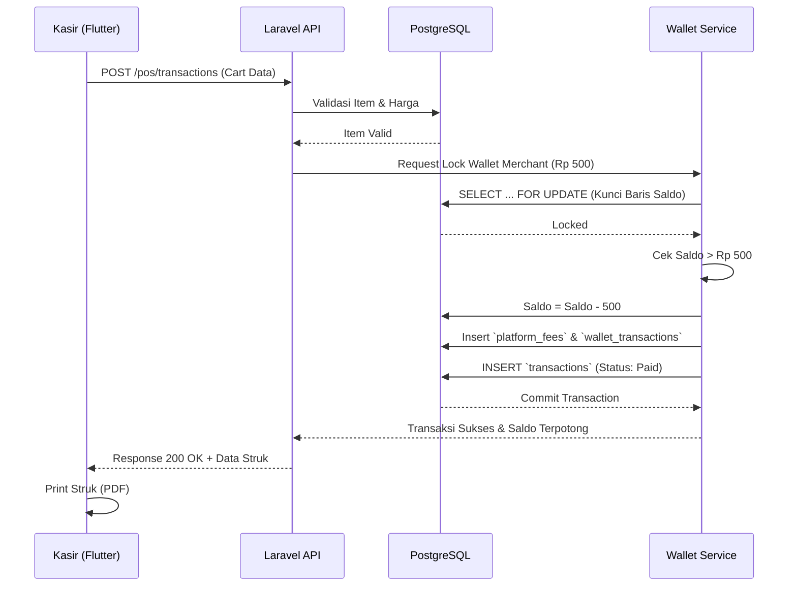
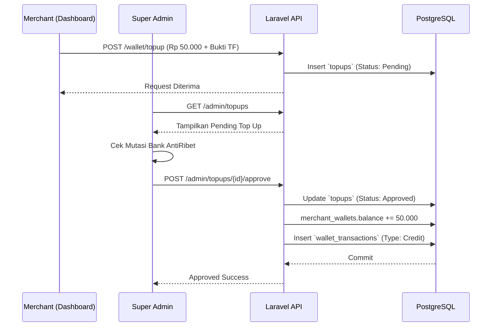
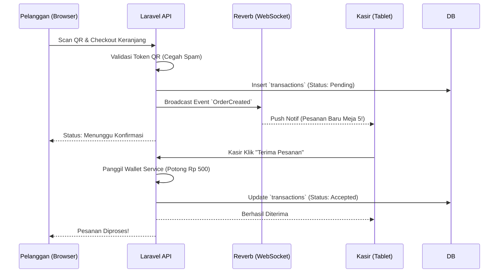
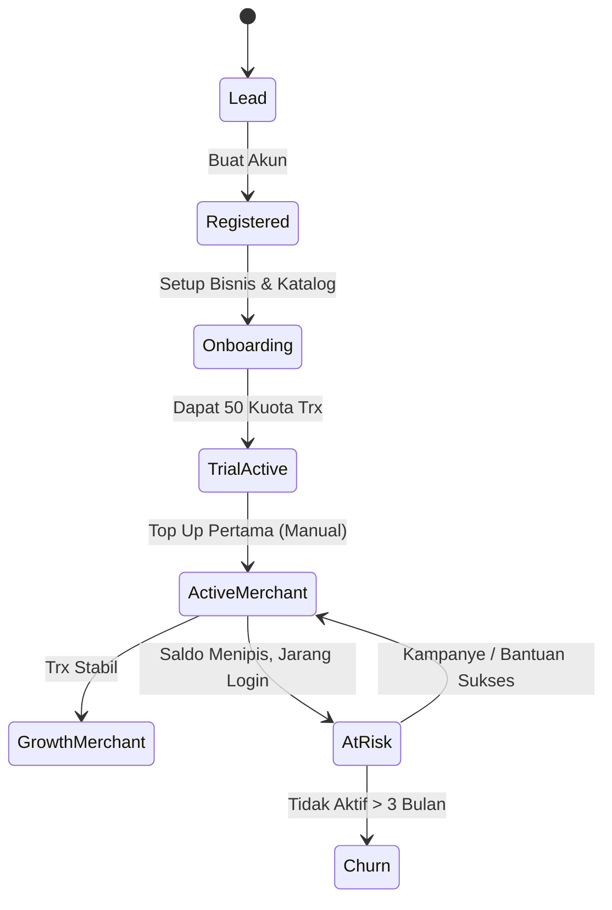

# ANTI RIBET: FLOWCHARTS & ALUR LOGIKA
Dokumen ini berisi representasi visual (Mermaid) dari alur transaksi dan arsitektur di AntiRibet.

## 1. Alur Transaksi Kasir (POS) & Potong Fee

## 2. Alur Top Up Merchant

## 3. Alur QR Order (Dengan Notifikasi Realtime)

## 4. Alur Bisnis: Lifecycle Merchant

